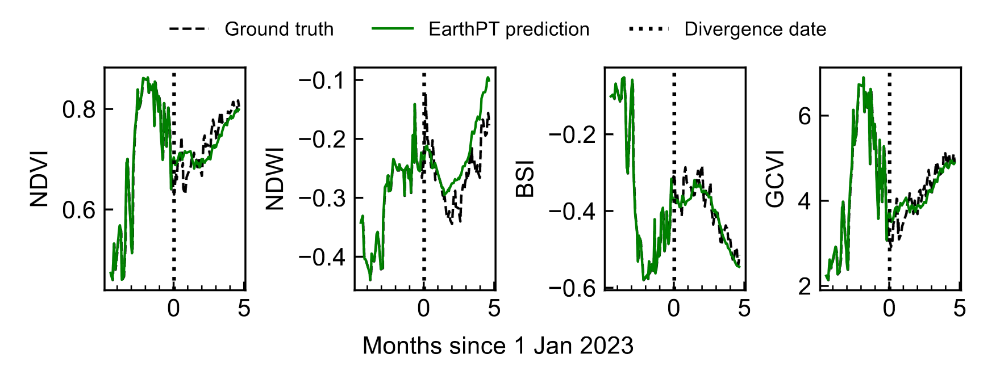

<p align="center">
    
</p>

# EarthPT

<p align="center">
    
</p>

A simple repository for training time series large observation models. This
repository began its life as Andrej Karpathy's
[nanoGPT](https://github.com/karpathy/nanoGPT), and has been altered so that
it is usable for time series data. `train.py` reproduces
[EarthPT-700M](https://arxiv.org/abs/2309.07207) when trained on 14B time
series 'tokens' of ClearSky EO data within the TL UK National Grid tile. When run,
`train.py` takes ~5 days to achieve Chinchilla 🐭 completion on a single 8xA100
40GB node.  Within `train.py` you will find a ~300-line boilerplate training loop
and within `model.py` you will find a ~300-line GPT model definition with an
MLP tokeniser and a regressive loss.

We have purposefully kept the code as simple and hackable as possible so that
it is easy for all to hack this base to their needs. We release this code under
the MIT licence in the hope that it will prove useful to others working on
EO and timeseries large observation models.

## install

Dependencies:

- `pip install -r requirements.txt`

## results

Our EarthPT-700M model is able to predict future satellite passes well into the
future, and also learns semantically meaningful information about the timeseries
that it is fed:

<p align="center">
    
</p>

You can find a plot with less angular momentum and further results in our paper
[here](https://arxiv.org/abs/2309.07207).

## pretrained weights

You can find our weights for all the EarthPT models on
[HuggingFace](https://doi.org/10.57967/hf/1598) 🤗.

## citation

If you find EarthPT useful in your work please do drop us a cite:

```bibtex
@article{ref_smith2023,
    author = {Smith, M. J. and Fleming, L. and Geach, J. E.},
    title = {{EarthPT: a time series foundation model for Earth Observation}},
    journal = {arXiv},
    year = {2023},
    eprint = {2309.07207},
    doi = {10.48550/arXiv.2309.07207}
}
```

This work is also in the
[proceedings](https://www.climatechange.ai/papers/neurips2023/2) of the 2023
CCAI NeurIPS workshop.
